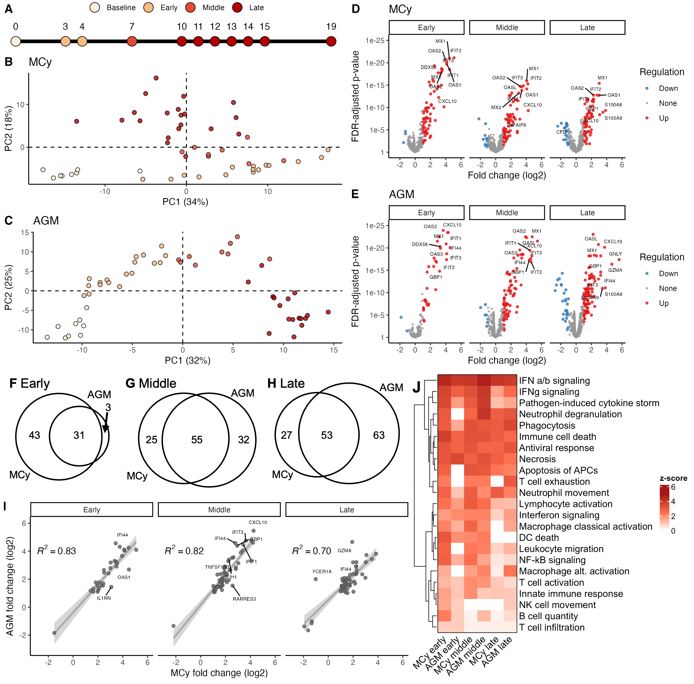

# LASV AGM mucosal model: Nanostring analyses

## Methods

The expression of 770 host mRNAs was quantified via the Nanostring NHP Immunology v2 panel according to the manufacturer’s instructions. Raw RCC files were loaded into [nSolver v4.0](https://nanostring.com/products/ncounter-analysis-system/ncounter-analysis-solutions/), and background thresholding was performed using the default parameters. Samples that did not pass the nSolver internal quality checks were removed. We similarly removed samples from AGM-4 (succumbed on day 29) and the two surviving MCM to assess the host response in acutely lethal animals. Thresholded count matrices were exported from nSolver and analyzed with [limma v3.62.1](https://doi.org/10.1093/nar/gkv007) ([edgeR v4.4.1](https://doi.org/10.1093/bioinformatics/btp616)) in R v4.4.2​.

Naïve clustering with principal component analysis (PCA) was used to bin time points into four disease states: baseline (0 DPI), early (3-4 DPI), middle (7 DPI), and late (10-19 DPI) (Figure A-C). Each postinfection group was compared to the baseline group to generate differential expression profiles. Genes with a log2 fold change of >1 or <-1 and an FDR-adjusted p-value < 0.05 were considered significantly differentially expressed (Figure D-E). We then assessed the similarities and differences between the MCM and AGM host responses to LASV challenge by quantifying the unique and intersecting differentially expressed (DE) genes at each disease stage (Figure F-H). Correlation analyses were performed for DE genes in both AGM and MCM (Figure I) to quantify whether DE genes detected in both animals were expressed at the same magnitude between species. Finally, pathway enrichment was performed via [Ingenuity Pathway Analysis (IPA)​](https://doi.org/10.1093/bioinformatics/btt703) to compare canonical and functional signaling pathways between species (Figure J).

## Data availability

The raw RCC files are available here: [`data/raw-rcc.tar.bz2`](data/raw-rcc.tar.bz2). All other inputs and output tables are in the [`data`](data/) folder. The unformatted output figures are in [`analysis`](analysis/). The code is in [`limma.r`](limma.r). 

 

